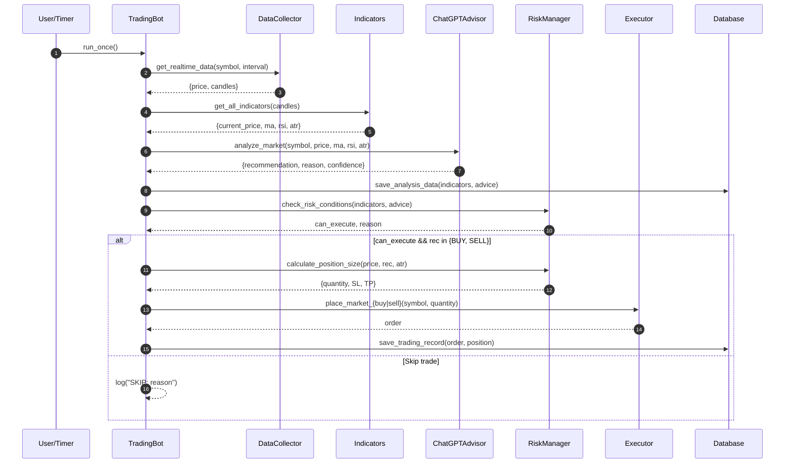
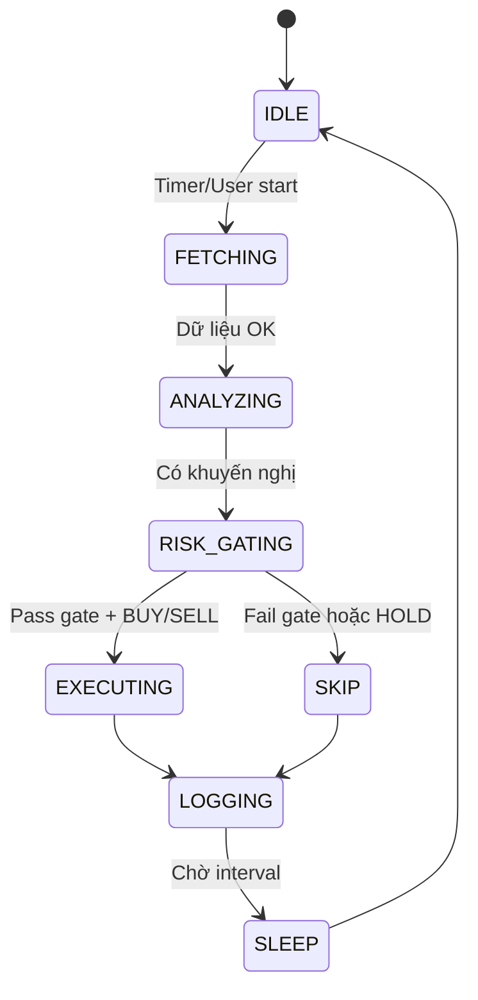

# 🔄 Trading Bot – Workflow tổng quan (Sơ đồ trực quan)

Tài liệu mô tả chi tiết luồng xử lý (end-to-end), dữ liệu vào/ra giữa các module, điều kiện ra quyết định, và chiến lược xử lý lỗi. Phù hợp cho việc vận hành, debug và mở rộng chức năng.

---

## 1) Kiến trúc mức cao (Component Diagram)

```mermaid
flowchart TB
    subgraph Binance[Testnet Binance]
        Mkt[Giá/Candles]
    end

    DC[Data Collector]\nLấy giá + candles
    TI[Technical Indicators]\nMA/RSI/ATR
    GPT[ChatGPT Advisor]\nBUY/SELL/HOLD + Reason
    RM[Risk & Order Manager]\nRisk Gate + Sizing + SL/TP
    EX[Trade Executor]\nĐặt lệnh Testnet
    DB[(Database & Logger)]
    RP[Reporting & Monitoring]\nBáo cáo + Equity

    Mkt --> DC --> TI --> GPT --> RM --> EX --> DB --> RP
    TI -- Lưu phân tích --> DB
    GPT -- Lưu đánh giá --> DB
```

1. Data Collector (Binance Testnet)
2. Technical Indicators (MA, RSI, ATR)
3. ChatGPT Advisor (AI phân tích)
4. Risk & Order Manager (kiểm soát điều kiện + sizing)
5. Trade Executor (đặt lệnh testnet)
6. Database & Logger (lưu phân tích, lệnh, performance)
7. Reporting & Monitoring (báo cáo, biểu đồ vốn)

---

## 2) Luồng xử lý tuần tự (Sequence Diagram)



1) Lấy dữ liệu thị trường
- Input: `symbol`, `interval`
- Module: `data_collector.get_realtime_data()`
- Output: `{ price, candles(DataFrame), timestamp }`

2) Tính chỉ báo kỹ thuật
- Input: `candles`
- Module: `technical_indicators.get_all_indicators()`
- Output: `{ current_price, ma, rsi, atr, raw_data }`

3) Phân tích bằng ChatGPT
- Input: `{symbol, current_price, ma, rsi, atr}`
- Module: `chatgpt_advisor.analyze_market()`
- Output: `{ recommendation(BUY/SELL/HOLD), reason, confidence, raw_response }`

4) Lưu phân tích
- Module: `database_logger.save_analysis_data(indicators, advice)`
- Mục tiêu: truy vết, đánh giá chiến lược về sau

5) Kiểm tra rủi ro & điều kiện giao dịch (gate)
- Module: `risk_manager.check_risk_conditions(indicators, advice)`
- Điều kiện mặc định:
  - RSI nằm trong vùng an toàn (ví dụ 25–75)
  - `confidence >= 60%`
  - Biến động không quá cao: `ATR/current_price <= 5%`
  - Không có lệnh mở xung đột (kiểm tra tại `trade_executor.get_open_orders()`)
- Output: `(can_execute: bool, reason: str)`

6) Tính khối lượng & SL/TP
- Module: `risk_manager.calculate_position_size(entry_price, signal, current_atr)`
- Quy tắc:
  - Risk per trade ≈ 1% account
  - SL mặc định 2% hoặc dùng `2×ATR`
  - TP mặc định 3% hoặc dùng `3×ATR`
- Output: `{ quantity, stop_loss, take_profit, risk_amount }`

7) Đặt lệnh trên Testnet
- Module: `trade_executor.place_market_buy/sell(symbol, quantity)`
- Lưu `order` vào DB: `database_logger.save_trading_record(order, position_info)`

8) Ghi log file & cập nhật báo cáo (định kỳ)
- File log: `trading_logs.txt`
- Báo cáo: `reporting_monitoring.generate_summary_report()`, `plot_equity_curve()`, `export_html_report()`

---

## 3) Sơ đồ trạng thái (State Machine)



---

## 4) State machine (trạng thái vận hành bot)

- IDLE → FETCHING → ANALYZING → RISK_GATING → (EXECUTING | SKIP) → LOGGING → (IDLE | SLEEP)

Mô tả:
- IDLE: chờ chu kỳ tiếp theo hoặc lệnh người dùng
- FETCHING: gọi Binance Testnet lấy dữ liệu
- ANALYZING: tính chỉ báo + gọi ChatGPT
- RISK_GATING: kiểm tra các điều kiện an toàn
- EXECUTING: gửi lệnh (nếu pass gate)
- SKIP: bỏ qua lệnh (nếu fail gate)
- LOGGING: lưu DB + ghi log
- SLEEP: chờ `interval_minutes` cho vòng kế

---

## 4) Luồng dữ liệu (Data Flow)

```mermaid
flowchart LR
    C[ candles ] -->|TI tính| I{Indicators}\nprice, MA, RSI, ATR
    I -->|for prompt| P[Prompt GPT]
    P --> A[Advice]\nrec + reason + conf
    I -.->|log| D[(DB)]
    A -.->|log| D
    I -->|risk input| R[RiskGate+Size]\nsize, SL, TP
    A --> R
    R -->|order| E[Executor]
    E -->|order+fills| D
    D -->|report source| RPT[Reporting]
```

- DataCollector → TechnicalIndicators: `candles` (DataFrame: open/high/low/close/volume/datetime)
- TechnicalIndicators → ChatGPTAdvisor: `{ current_price, ma, rsi, atr }`
- ChatGPTAdvisor → RiskManager: `{ recommendation, reason, confidence }`
- RiskManager → TradeExecutor: `{ quantity, stop_loss, take_profit }` + `recommendation`
- TradeExecutor → DatabaseLogger: `order` (orderId, symbol, side, qty, price, status)
- DatabaseLogger → Reporting: `analysis_data`, `trading_history`, `performance`

---

## 5) Điều kiện an toàn & quy tắc vào lệnh (Gateway)

- Không vào lệnh khi:
  - `RSI < 25` hoặc `RSI > 75` (thị trường quá cực đoan)
  - `confidence < 60%`
  - `ATR/current_price > 5%` (biến động quá cao)
  - Đã có lệnh mở xung đột
- Chỉ vào lệnh khi:
  - `recommendation ∈ {BUY, SELL}`
  - Pass Risk Gate
  - R/R đạt yêu cầu (ví dụ ≥ 1.5 nếu có)

---

## 6) Xử lý lỗi & timeout (Runbook)

1) Lỗi Binance (mạng/API):
- Retry với backoff (3 lần: 1s → 3s → 5s)
- Nếu vẫn lỗi: ghi log + bỏ qua chu kỳ

2) Lỗi OpenAI (quota/timeout):
- Fallback: dùng `simple_analysis()` hoặc chỉ báo kỹ thuật để quyết định HOLD
- Ghi log lý do và tiếp tục

3) Lỗi DB (file lock):
- Retry ghi sau 1–2 giây; nếu không được, buffer dữ liệu và ghi ở chu kỳ sau

4) Lỗi logic (KeyError/ValueError):
- Bọc try/except tại từng bước; log traceback ngắn gọn và bỏ qua lệnh

---

## 7) Quan trắc & báo cáo

- On-demand: menu `main.py` option 4 tạo:
  - Console report (30 ngày)
  - `duong_cong_von.png`
  - `trading_report.html`

KPI gợi ý:
- Win Rate, Total PnL, Avg Win/Loss, Profit Factor, Drawdown, Sharpe (nếu bổ sung)

---

## 8) Checklist triển khai/vận hành

- [ ] `.env` có `BINANCE_API_KEY`, `BINANCE_SECRET_KEY`, (tuỳ chọn) `OPENAI_API_KEY`
- [ ] `pip install -r requirements.txt`
- [ ] `python main.py` → chọn 0 để chạy GUI hoặc chạy CLI
- [ ] Xem log tại `trading_logs.txt`, DB `trading_history.db`
- [ ] Tạo báo cáo khi cần (menu 4)

---

## 9) Mở rộng tương lai

- Thêm indicator (MACD, Bollinger Bands), filter volume
- Quản lý danh mục đa tài sản; đồng bộ nhiều symbol cùng lúc
- Kelly/Markowitz để tối ưu phân bổ vốn
- Thêm backtesting & paper-trading
- Tích hợp cảnh báo Telegram/Discord


